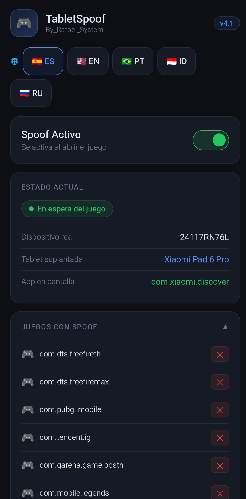

# 🎮 TabletSpoof v5.0 — By Rafael System

Magisk / KernelSU / APatch module that makes your phone identify itself as a high-end tablet or gaming phone to your games.
Result: tablet graphics, wider field of view, and real competitive advantage.

---

## 📋 Requirements

- Root with **Magisk**, **KernelSU** or **APatch**
- Android 10 or higher
- Compatible with stock and custom ROMs (LineageOS, PixelExperience, crDroid, etc.)

---

## 🖥️ Available device profiles

| Profile | Device | Type | DPI |
|---|---|---|---|
| `xiaomi` | Xiaomi Pad 6 Pro | Tablet | 240 |
| `redmagic` | REDMAGIC Astra (NP05J) | Gaming Phone | 240 |
| `rog` | ASUS ROG Phone 8 Pro | Gaming Phone | 446 |
| `redmagic9` | RedMagic 9 Pro (NX769J) | Gaming Phone | 446 |
| `blackshark` | Black Shark 5 Pro | Gaming Phone | 392 |

You can switch between profiles at any time from the **WebUI** without rebooting.

---

## ⚙️ How it works

The module detects which app is in the foreground. When you open a game from your list, it automatically applies the selected profile's props using `resetprop`. When you close the game, everything reverts to the original state. **Zero permanent changes to the system.**

The DPI toggle is optional — enable or disable it from the WebUI as needed.

---

## 🌐 WebUI (KernelSU / APatch)

Manage the module directly from the graphical interface:

- ✅ Enable / disable spoofing with a toggle
- 🖥️ Select device profile (tablet or gaming phone)
- 📱 View the real device detected at boot
- 🎮 Manage your game list
- 📐 Independent DPI toggle
- 🌍 Language selector: **Spanish | English | Português | Bahasa Indonesia | Русский**

> Profile changes apply on the fly via the flags system — no reboot required.

---

## 🎯 Supported games (default list)

- Free Fire / Free Fire MAX
- PUBG Mobile
- Mobile Legends: Bang Bang
- Call of Duty Mobile
- Apex Legends Mobile

You can add any additional game from the WebUI by entering its package name.

---

## ✅ Tested on

- Xiaomi Redmi Note 14 4G — Android 14 — Stock ROM

---

## 📦 Installation

1. Download the `.zip` from [Releases](https://github.com/ByRafaelSystem/Tablet-Spoofing-/releases).
2. Open **Magisk / KSU / APatch** → Modules → Install from storage.
3. Select the file and flash it.
4. Reboot your device.
5. Open the WebUI (KSU/APatch) or the module in Magisk to configure.

---

## ⚠️ Reporting issues

If something doesn't work, open an Issue with:
- Device and ROM
- Android version
- Root manager (Magisk / KSU / APatch) and its version

---

## 📄 License

Apache License 2.0 — see [LICENSE](LICENSE)
